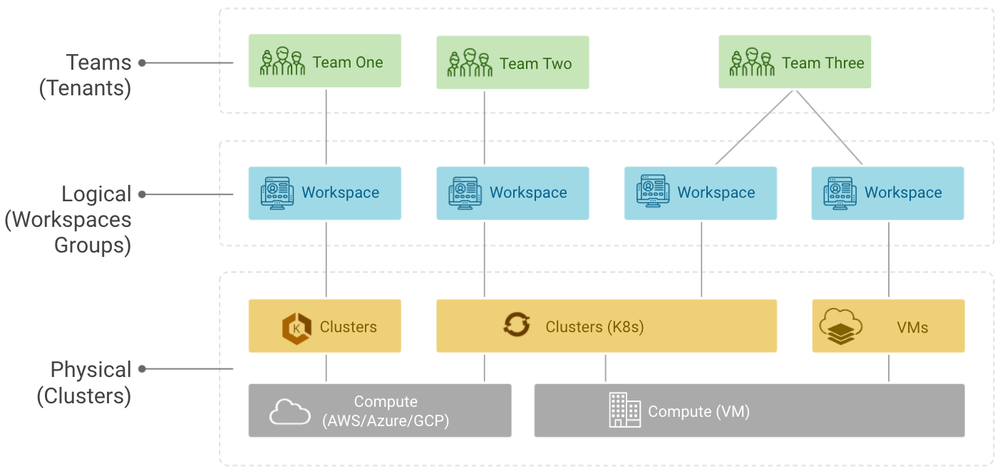

# Overview
The first thing that is needed prior to working deploying and introduce applications and config into our global mesh is are the objects that create multi-tenancy within Tetrate Service Bridge.  The Tenant, Workspace(s), and Group(s) that are created will allow us to bind policy and configuration to our applications, controlling application traffic and routing, security, and observability.  The concepts within multi-tenancy are also where we bind the logical concepts of an Application and associated mesh configuration to physical compute infrastructure.



During this lab we will utilizing the `tctl` CLI to interact with the TSB Management Plane.  As we ensured with our previous lab, you will need to ensure that your `tctl` CLI is targeted and logged into the TSB management plane.  A simple test is retrieving the tenants we have access to:

```bash
tctl get tenant
```

If you are not logged in please return to the environment access and complete the TCTL CLI login section prior to continuing.

## Tenants
Since a `Tenant` is at the top of the multi-tenancy hierarchy this object has already created.  Your tenant is dedicated to your applications and namespaces.  Let's take a close look at the API Objects that defined the `Tenant`.

1. Once again execute the `tctl` CLI command to retrieve your tenant details.  This time will instruct the command to output the object in YAML form.  This API Object is about as simple as it gets; the `organization` and `name` fields are the most relevant as these uniquely identify your tenant within the system.
```bash
tctl get tenant -o yaml
```
```yaml
---
apiVersion: api.tsb.tetrate.io/v2
kind: Tenant
metadata:
  description: ABZ Tetrate Workshop
  displayName: ABZ Tetrate Workshop
  name: abz-tetrate-workshop
  organization: tetrate-workshop
  resourceVersion: '"UHEEfLYLVws="'
spec:
  description: ABZ Tetrate Workshop
  displayName: ABZ Tetrate Workshop
  etag: '"UHEEfLYLVws="'
  fqn: organizations/tetrate-workshop/tenants/abz-tetrate-workshop
```

2. You'll also note that there is a second API Object which configures some basic RBAC on the tenant.  Your workshop user has been configured to be an admin of this tenant.  In practice, this binding provides the opportunity to map an organizations user and groups to roles, groups, and mutli-tenancy objects within TSB.
```bash
tctl get tenantaccessbindings -o yaml
```
```yaml
---
apiVersion: rbac.tsb.tetrate.io/v2
kind: TenantAccessBindings
metadata:
  name: demo-workshop
  organization: tetrate-workshop
  tenant: demo-workshop
spec:
  allow:
  - role: rbac/admin
    subjects:
    - user: admin
    - team: organizations/tetrate-workshop/teams/91d830b6-83c8-41a4-abbf-3bf64ac5b8fd
```

## Create Workspaces
Next we will create a few different `Workspaces` that will model the applications that we well be utilizing during the workshop:
1. Demo App
2. Market Data App

Apply the configuration using the `tctl apply` command:

```bash
envsubst < 01-multi-tenancy/01-workspaces.yaml | tctl apply -f -  
```

Let's inspect the workspace configuration applied in more detail.  Each workspace is nearly identical; though obviously meta-data such as *name* need to be unique.  `Workspaces` also have a parent `Tenant`.  Additionally, workspaces are the construct that maps the logical multi-tenancy constructs of TSB to the physical infrastructure.  This is done via selectors that are made up of a cluster/namespace tuple.  Wildcards are also supported.  Inspect the file `01-multi-tenancy/01-workspaces.yaml` to understand this mapping.

```yaml
---
apiversion: api.tsb.tetrate.io/v2
kind: Workspace
metadata:
  tenant: $PREFIX-workshop
  organization: tetrate-workshop
  name: demo-app
spec:
  description: Demo App
  displayName: Demo App
  namespaceSelector:
    names:
      - "*/$PREFIX-demo-app"
```

## Create Workspace Groups
Lastly we'll create `Groups`, which is the contstruct within the TSB multi-tenancy model that contains service mesh configuration for an application.  For now we'll only create a set of `Gateway Groups`, which is the bare minimum needed to expose our services via ingress gateways.  The configuration is deployed to TSB using the `tctl apply` command:

```bash
envsubst < 01-multi-tenancy/02-groups.yaml | tctl apply -f -
```

Open the file `01-multi-tenancy/02-groups.yaml` and view the `Group` definitions.  You'll note it is similar to our previous API objects we looked at.  It contains metadata that map the object to its parent `Tenant` and `Workspace` plus it offers you the ability to further refine the infrastructure configuration is delivered to using cluster/namespace selectors.

```yaml
---
apiVersion: gateway.tsb.tetrate.io/v2
kind: Group
metadata:
  tenant: $PREFIX-workshop
  organization: tetrate-workshop
  workspace: marketdata
  name: marketdata-gw
spec:
  displayName: Market Data Gateway
  description: Market Data Gateway
  namespaceSelector:
    names:
      - "*/*"
  configMode: BRIDGED
```

Each of the objects we've created so far have been logical, providing for multi-tenancy and RBAC control.  However, next we will begin configuring our applications within TSB and the global service mesh!
