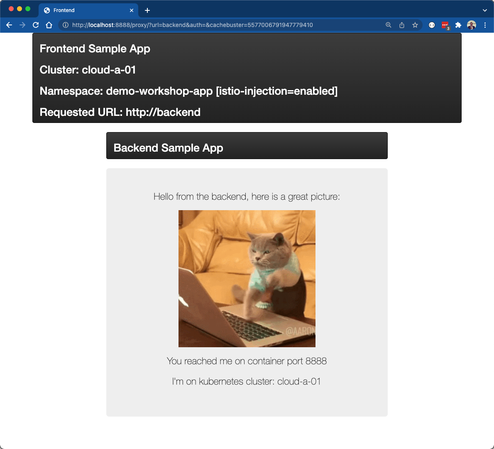
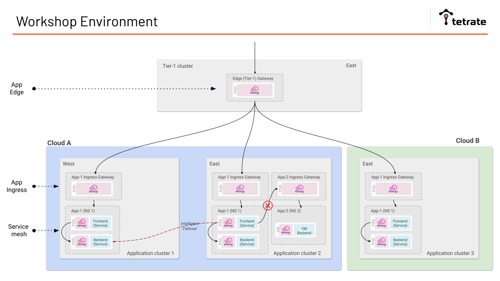

# Overview
Now we need to all our sample applications. As a reminder, we'll be working with 2 applications:
1. Demo App
2. Market Data App

The steps to deploy the applications are largely identical; the main change will be ensuring that you are targeting the correct kubernetes cluster in your kube context file.  However, since we will be demonstrating workload migration from a VM to kubernetes with mesh, we won't deploy our Market Data app quite yet.

## Application Deployment
Prior to installing ensure you have set an environment variable in the shell you are using named `PREFIX`.  This value should already be configured on your workshop jumpbox assigned to you.  This will be used to prefix common objects, such as namespaces, dns entries, TSB tenants and workspaces, etc such that your appliations and configuration will not collide with others running this workshop on shared infrastructure.

```bash
echo $PREFIX
```

### Demo App
The demo application is comprised of a frontend and a backend service plus an Istio IngressGateway, all deployed to a dedicated namespace.  We will be deploying this application to 3 different clusters.  Note that we are deploying this application to different clusters using the `--context` flag in each command.  Deploy the applications and Istio IngressGateway using `kubectl`.

```bash
envsubst < 02-app-deploy/cloud-a-01/app.yaml | kubectl --context cloud-a-01 apply -f -
envsubst < 02-app-deploy/cloud-a-01/cluster-ingress-gw.yaml | kubectl --context cloud-a-01 apply -f -
envsubst < 02-app-deploy/cloud-a-02/app.yaml | kubectl --context cloud-a-02 apply -f -
envsubst < 02-app-deploy/cloud-a-02/cluster-ingress-gw.yaml | kubectl --context cloud-a-02 apply -f -
envsubst < 02-app-deploy/cloud-b-01/app.yaml | kubectl --context cloud-b-01 apply -f -
envsubst < 02-app-deploy/cloud-b-01/cluster-ingress-gw.yaml | kubectl --context cloud-b-01 apply -f -
```

While the application starts up, lets inspect the 2 items that introduce this application into the global service mesh.  
1. Inspect the file `02-app-deploy/cloud-a-01/app.yaml`.  You'll note our namespace has a label enabling Istio for any application pods.
```yaml
---
apiVersion: v1
kind: Namespace
metadata:
  name: $PREFIX-workshop-app
  labels:
    istio-injection: enabled # This label will causes our application pods to receive an envoy sidecar container
...
```

2. Inspect the file `02-app-deploy/cloud-a-01/cluster-ingress-gw.yaml`.  This is a Tetrate-specific `CustomResourceDefinition` that will deploy and optimally configure a dedicated Istio `IngressGateway` for the applications in this namespace.
```yaml
---
apiVersion: install.tetrate.io/v1alpha1
kind: IngressGateway
metadata:
  name: $PREFIX-tsb-gateway
  namespace: $PREFIX-workshop-app
spec:
  kubeSpec:
    service:
      type: LoadBalancer
      annotations:
        "external-dns.alpha.kubernetes.io/hostname": "demo-app.cloud-a-01.$PREFIX.workshop.cx.tetrate.info."
...
```

Though this YAML file is fairly terse and simple, a lot was configured under the covers.  The Tetrate platform will translate this request into an `IstioOperator` deployment of an Istio `IngressGateway`.  You can view this configuration by executing:
```bash
kubectl --context cloud-a-01 get istiooperator -n istio-gateways tsb-gateways -o yaml
```

By now our application should be running and pods/services introduced into the global service mesh.  We even have an Istio `IngressGateway` bound to an external load balancer and DNS entry (via `external-dns`).  However, we have not deployed any mesh configuration yet so our application will not be accessible external from the mesh.  For now we can verify our application is running and functioning properly in the mesh by port-forwarding.  

First, lets find the external IP address assigned by AWS to your jumpbox by curling the metadata endpoint exposed locally.  You will use this address when you open a browser window.

```bash
curl http://169.254.169.254/latest/meta-data/public-ipv4
```

Then setup the port-forwarding
```bash
kubectl --context cloud-a-01 port-forward -n $PREFIX-workshop-app $(kubectl --context cloud-a-01 get po -n $PREFIX-workshop-app --output=jsonpath={.items..metadata.name} -l app=frontend)  --address 0.0.0.0 8888:8888 
```

Open your browser and navigate to `<JUMPHOST EXTERNAL IP>:8888`.  Enter `backend` in the Backend HTTP URL text box and submit the request.  This will cause the frontend microservice to call to the backend microservice over the service mesh and return the display the response via the frontend app.



You may now choose to close the port forward in the shell by pressing Ctrl-C .

### Tier 1 Gateway Deployment
Lastly, in preparation for load balancing our application across clouds and cloud-provider regions, we will deploy a Tier 1 gateway.



1 - Deploy the Istio IngressGateway using `kubectl` to the Tier1 cluster:

```bash
envsubst < 02-app-deploy/tier1/cluster-t1.yaml | kubectl --context tier1 apply -f -
```
