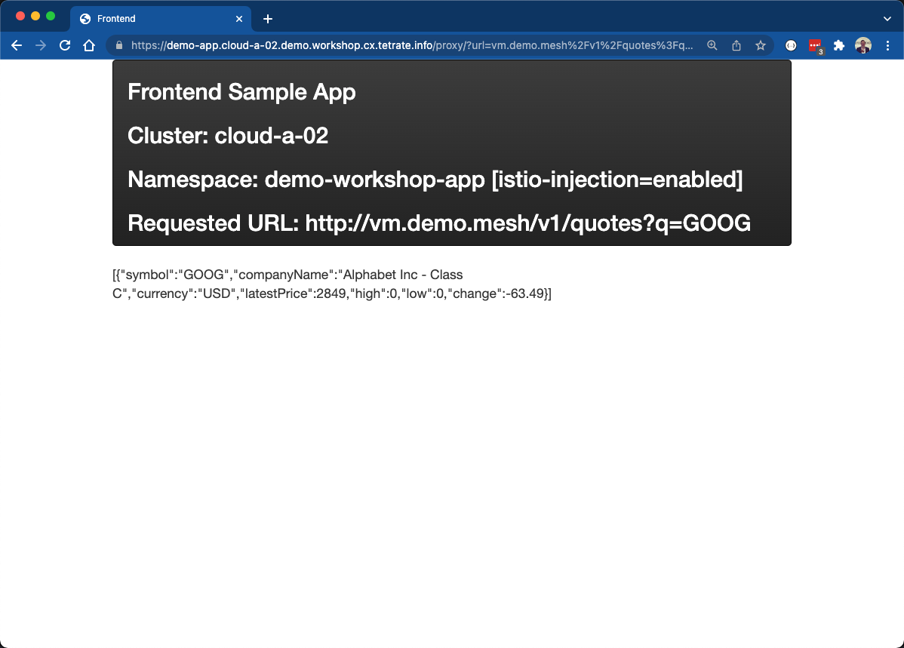
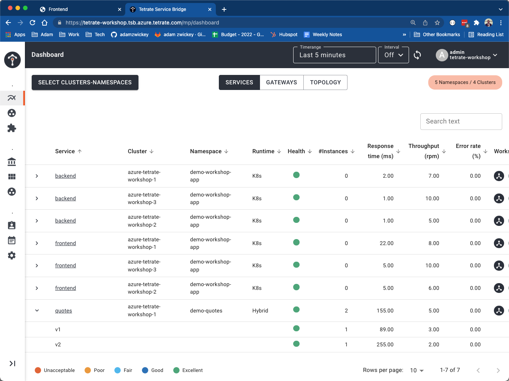
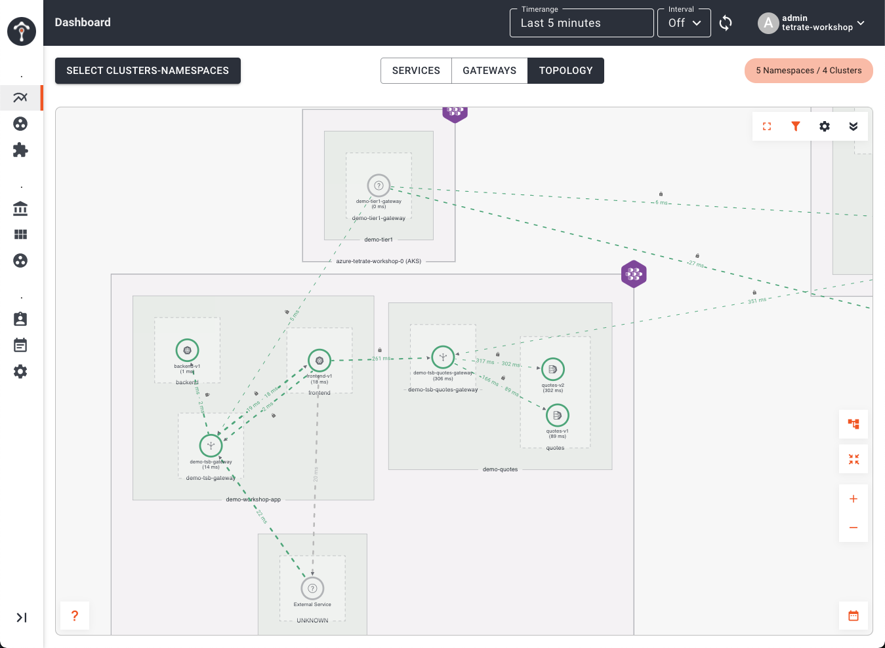

# Overview
Although containers and Kubernetes are widely used, there are still many services deployed on virtual machines (VMs) and APIs outside of a Kubernetes cluster can also benefit from being part of a global service mesh. It is possible to bring these VMs into TSB and the underlying Istio mesh. To successfully extend an Istio/Kubernetes cluster to a VM, the VM workload(s) must be able to do the following:

- **Authentication:** The VM must establish an authenticated encrypted session to the control plane. The VM must prove that it is allowed to join the cluster.
- **Routing:** The VM must be aware of the services defined in the Kubernetes cluster and vice-versa. If the VM runs a service, it must be visible to pods running inside the cluster.

Onboarding a Virtual Machine (VM) into a TSB managed Istio service mesh can be broken down into the following steps:

- Create kubernetes namespace, service , and serviceaccount for VM Workloads. 
- Create an `OnboardingPolicy` and register the VM(s) `WorkloadGroup` with the Istio control plane, along with the associated Istio `Sidecar` policy.
- Install Envoy proxy on VM (typically RPM or DEB package)
- Install, Configure, and Inititialize the Tetrate Onboarding-Agent on the VM.

## Onboarding a VM
We will onboard the Market Data service into the mesh in order to demonstrate traffic originating from the Global Service mesh routing to the application on the VM.

For simplicity's sake, we'll utilize our jumpbox to run our VM application; in other words our jumpbox will be onboarded into the Global Service Mesh.  First, lets start our application:

- Start the application inside a docker container:
```bash
docker run --name quotes -d -p 127.0.0.1:8081:8080 gcr.io/abz-perm/quotes:v1
```

- Our application is configured to only listen on the local loopback adapter, since eventually the envoy sidecar proxy will serve as the external listener.  You can verify that the application is running and funcitonal using curl:
```bash
curl -i localhost:8081/quotes/GOOG
```

### Onboarding
1. Our Market Data microservice will run in its own namespace, so first we need to create the `Namespace` and `ServiceAccount` using kubectl:
```bash
envsubst < 05-vm-integration/01-basic-k8s-objects.yaml | kubectl --context cloud-a-01 apply -f -
``` 

2. Eventually, we'll test connecting to our VM using service discovery via the global mesh.  Since we're going to test out connecting to our application across cluster and clouds, we'll need to create an ingress gateway for traffic originating outside the local cluster.  Apply these objects using kubectl:
```bash
envsubst < 05-vm-integration/02-services.yaml | kubectl --context cloud-a-01 apply -f -
``` 

Take a look at the file `05-vm-integration/02-services.yaml`.  First you'll see a standard kubernetes service that exposes kubernetes pods that match the selector `app: quotes` on port 8080.  This will eventually match our VM.

```yaml
spec:
  ports:
  - port: 8080
    name: http
  selector:
    app: quotes
  type: ClusterIP
```

You'll also see the definition of the `IngressGateway` object for exposing services in this namespace.  We do not need any annotations to configure DNS (via External DNS) nor any certificates because in our scenario we will only connect to our service via the global mesh, which will already provide service discovery and will use mTLS for securing and encrypting the connection.

3. Next, we'll create the Istio objects associated with VM Workloads, along with the Tetrate-specific custom resource that allows a policy-driven auto-registration of the workloads.  Specifically, these are a Istio `WorkloadGroup`, Istio `Sidecar`, and Tetrate `OnboardingPolicy`.  Apply these using kubectl, then we'll inspect and explain them in more detail:

```bash
envsubst < 05-vm-integration/03-workload-onboarding-k8s.yaml | kubectl --context cloud-a-01 apply -f -
``` 

Take a look at the file `05-vm-integration/03-workload-onboarding-k8s.yaml`.  
- You will see the definition of the `WorkloadGroup`, which, in effect, represents a collection of VMs -- very similar to a kubernetes ReplicaSet.  The `spec` definition is pretty simple.  It informs the mesh how to assign a service identity, the SPIFFE Idenitity in the x509 ceritifcate, along with the labels that can be used to select our VM and associate with other Kubernetes objects, such as our `Service` we just defined with the selector `app: quotes`.  The `network` attribute is also important as this instructs the mesh whether the VM and pods are directly routable or if there is a gateway required for communication.
```yaml
spec:
  template:
    labels:
      app: quotes
      version: v1
      class: vm
    serviceAccount: quotes-vm
    network: external
```

- Additionally, the `Sidecar` controls the mesh configuration for the VM Envoy proxy -- aka the sidecar.  The selectors match what is configured in the `WorkloadGroup`, ensuring this `Sidecar` is applied to any VM that joins the `WorkloadGroup`.  Most importantly, you'll note the section in the `spec` that outline how ingress, and optionally egress, is configured for the VM workload and the proxy.  Our quotes service is listening on the VM at `127.0.0.1:8081` and we want to expose it to kubernetes on port 8080.  The port name and number match what was previously configured in the kubernetes `Service` object:
```yaml
spec:
  workloadSelector:
    labels:
      app: quotes
      class: vm
      version: v1
  ingress:
  - defaultEndpoint: 127.0.0.1:8081
    port:
      name: http
      number: 8080
      protocol: HTTP
```

- Lastly, we created a Tetrate-specific custom resource that greatly reduces the effort to actually onboard a VM.  Creating an `OnboardingPolicy` allows us to define what VMs are authorized to automatically register and join the mesh.  In our case, we're allowing VMs with a specific IAM role w/in the an individual Tetrate AWS account to join our WorkloadGroup:

```yaml
allow:
  - workloads:
    - aws:
        accounts:
        - '192760260411'
        ec2:
          iamRoleNames:
          - workshop-role
    onboardTo:
    - workloadGroupSelector:
        matchLabels:
          app: quotes
```

We can curl the metadata endpoint to verify that our jumpbox matches this criteria.  Note the account ID and the instance profile in ARN:  

```bash
curl http://169.254.169.254/latest/meta-data/iam/info
```

4. Next, we need to install the onboarding agent, which drives auto-registration, and the Envoy proxy on our jumpbox.  These can be downloaded from an endpoint exposed on the service mesh control plane.  Execute the following commands to download and install these components:

```bash
wget https://onboarding.cloud-a-01.workshop.cx.tetrate.info/install/rpm/amd64/istio-sidecar.rpm
wget https://onboarding.cloud-a-01.workshop.cx.tetrate.info/install/rpm/amd64/istio-sidecar.rpm.sha256
sha256sum --check istio-sidecar.rpm.sha256
sudo yum -y install istio-sidecar.rpm

wget https://onboarding.cloud-a-01.workshop.cx.tetrate.info/install/rpm/amd64/onboarding-agent.rpm
wget https://onboarding.cloud-a-01.workshop.cx.tetrate.info/install/rpm/amd64/onboarding-agent.rpm.sha256
sha256sum --check onboarding-agent.rpm.sha256
sudo yum -y install onboarding-agent.rpm
```

5. Lastly, we need to configure and start the onboarding agent.  The onboarding agent will read its config from a file located at: `/etc/onboarding-agent/onboarding.config.yaml`.  Copy the configuration to that location and start the agent with the command:

```bash
envsubst < 05-vm-integration/04-onboarding-config.yaml > /tmp/onboarding.config.yaml
sudo mv /tmp/onboarding.config.yaml /etc/onboarding-agent/onboarding.config.yaml
sudo systemctl start onboarding-agent
```

Take a look at the file `05-vm-integration/04-onboarding-config.yaml`.  The primary information that is configured is a) the onboarding endpoint exposed by the service mesh and b) the `WorkloadGroup` that the VM is joining and c) the labels to attach to the workload.  The most important piece, which is the identity of the VM that must match the rules configured in the `OnboardingPolicy` will be derived from the VM and cloud environment itself.

```yaml
...
onboardingEndpoint:
  host: onboarding.cloud-a-01.workshop.cx.tetrate.info
  transportSecurity:
    tls:
      sni: onboarding.cloud-a-01.workshop.cx.tetrate.info
workloadGroup:
  namespace: $PREFIX-quotes
  name: quotes
settings:
  connectedOver: INTERNET
workload:
  labels:
    app: quotes
    version: v1
    class: vm
```

We can verify that onboarding was successful by executing the following commands.

This verifies that the Envoy proxy is running:
```bash
curl -i http://localhost:15000/ready
```

This outputs the logs from the onboarding exchange and the Envoy proxy startup:
```bash
journalctl -u onboarding-agent -ocat
```

The `WorkloadAutoRegistration` will inform us of any VMs registered with the workload while the `WorkloadEntry` will inform us of workloads associated with the `WorkloadGroup`:
```bash
kubectl --context cloud-a-01 -n $PREFIX-quotes describe WorkloadAutoRegistration

kubectl --context cloud-a-01 -n $PREFIX-quotes get workloadentries.networking.istio.io
```

6. Our VM is now onboarded into the service mesh.  However, our last step is to expose a endpoint for global service discovery and routing.  Using the `tctl apply` command create a Tetrate `IngressGateway` for the VM workload.  Under the covers TSB will create all the needed service mesh configuration objects. Execute the following apply commands and then we'll inspect the configuration a bit further:

```bash
envsubst < 05-vm-integration/05-tsb-config.yaml | tctl apply -f -   
```

Let's dig into what what was actually configured via TSB and within the global service mesh that will enable routing to our VM.  Inspect the file `05-vm-integration/05-tsb-config.yaml`.  As is the case with all our other TSB objects, you'll see a set of metadata is provided that maps this `IngressGateway` object to all the relevant multi-tenancy objects for our Market Data workspace; Tenants, Workspaces, and Groups.  In fact, this `IngressGateway` is nearly idenitical to the objects we configured for our demo-app.  However, you'll note we are only exposing an internal endpoint, `vm.$PREFIX.mesh`, that maps to the quotes serivce, which is the kubernetes service that is backed by VMs that register themselves with the `WorkloadGroup`  

```yaml
http:
- name: vm-internal
    port: 80
    hostname: vm.$PREFIX.mesh
    routing:
    rules:
    - route:
        host: "$PREFIX-quotes/quotes.$PREFIX-quotes.svc.cluster.local"
        port: 8080
```

### Testing the Application
Now we can test our VM service via the mesh.  We will test via the demo application that is running in our Cloud B 01 Cluster.  Open a browser and navigate to https://demo-app.$PREFIX.workshop.cx.tetrate.info (replace $PREFIX with your actual prefix and make sure you're using https not http).  In the Backend HTTP URL field enter the URL route we just configured, which should be in the form of `vm.$PREFIX.mesh/quotes/GOOG` (again, replace $PREFIX with your actual prefix).  We should see a response from our VM backend hosting our quotes service!



9. We could also verify that communication is working properly by looking at log files on our VM.  Check the logs for the Market Data java application running in docker:

```bash
docker logs quotes
```
```bash
.....
c-4] io.tetrate.quotes.service.QuoteService   : QuoteService.getQuote: retrieving quote for: GOOG
2022-02-07 18:15:55.171 DEBUG [quotes-service,075568e0e5aae0ef51ff318cc0298560,48a54534e66b2357] 1 --- [nio-8080-exec-4] io.tetrate.quotes.service.QuoteService   : QuoteService.getQuote: retrieved quote: Quote [change=-63.49, companyName=Alphabet Inc - Class C, high=0, latestPrice=2849, low=0, symbol=GOOG]
2022-02-07 18:15:55.172  INFO [quotes-service,075568e0e5aae0ef51ff318cc0298560,48a54534e66b2357] 1 --- [nio-8080-exec-4] i.t.quotes.controller.QuoteV1Controller  : Retrieved symbols:GOOG with quotes [Quote [change=-63.49, companyName=Alphabet Inc - Class C, high=0, latestPrice=2849, low=0, symbol=GOOG]]
```

Additionally, you can also see logs in the envoy proxy sidecar container that is running on the VM.  These can be retrieved using the `journalctl -u onboarding-agent -f` command:

```bash
journalctl -u onboarding-agent -f
```
```bash
.....
Feb 07 18:15:55 ip-10-0-0-221.us-east-2.compute.internal bash[4184]: [2022-02-07T18:15:55.030Z] "GET /quotes/GOOG HTTP/1.1" 200 - via_upstream - "-" 0 127 142 141 "172.41.0.66" "Go-http-client/1.1" "a8b0f221-b884-4004-a28e-25732b2c2d36" "vm.demo.mesh" "127.0.0.1:8081" inbound|8080|| 127.0.0.1:47506 10.0.0.221:8080 172.41.0.66:0 outbound_.8080_._.quotes.demo-quotes.svc.cluster.local default
```

## Deploy Hybrid Application
Suppose you now have migrated your VM workload to a container and would like to split traffic between the VM and cloud-native version.  This is handled automatically by the global service mesh.

- Deploy a containerized version of the market data application into kubernetes using kubectl apply:

```bash
envsubst < 05-vm-integration/06-app-k8s.yaml | kubectl --context cloud-a-01 apply -f -
```

This will create a deployment and pod of the same application.  The only difference between our VM version is our kubernetes pod deployment has the label `version: v2`.  Refresh the browser window that has the Frontend app, which called the backend: `vm.free.mesh/quotes/GOOG` a few times in order to generate a bit of traffic to bother version of the service.

- Traffic will now be split between the VM version and the containerized version.  Lets view our application metrics within the TSB UI.   Going back to the TSB UI, refresh the browser that has the TSB application open.  Click the *Select Clusters-Namespaces* button an add the $PREFIX-quotes namespace to the list of services to be displayed.  In the application dashboard view, click on the `Quotes` service to expand all versions.  You'll note that it is marked has *hybrid* and 2 versions of our service are listed.



Additionally, click on *Topology* on the top menu.  You'll now see the frontend application connecting to the marketdata gateway, which will load balance requests between the VM Version (v1) and the Pod version (v2).  All of this communication is secured via mTLS.


